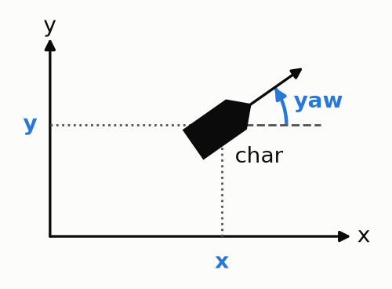
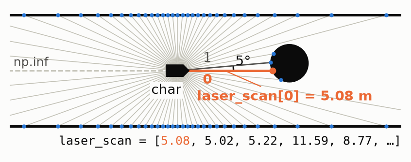
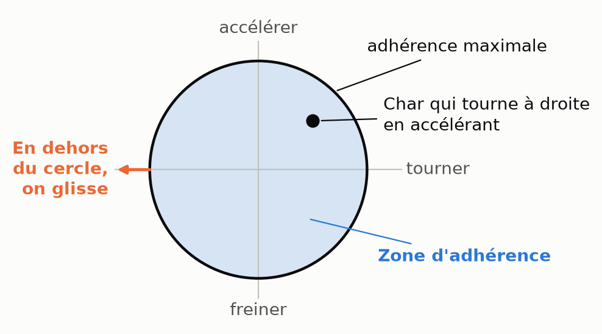
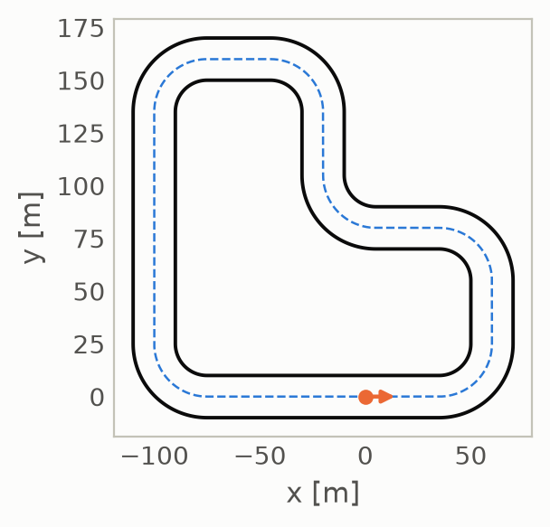

# 🏎️ Défi vroom vroom

> **What's up gamers!** 🎮🕹️
>
> Bienvenu au défi vroom vroom où tu codes ton propre chauffeur de course un peu chaud marde. 🍻

---

## Premiers pas

1. **Crée un compte** pour ton équipe sur le site web `http://132.203.92.69:80`.
2. **Note ton username pis ton mot de passe.** (Sinon genre skull 💀 issue bro retourne chez toi)
3. **Push une première version** de ton contrôleur `my_car.py`.

Chaque push accepté est gardé comme une version, `v1`, `v2`, `v3`..., avec une description optionnelle, pis tu peux pull n'importe laquelle de tes versions.

---

## Comment gagner ?

### 🎰 Qualifications

Il y a des qualifications **à toutes les 2 minutes**.

- C'est l'occasion de tester ton contrôleur.
- C'est aussi l'occasion d'accumuler des points pour avoir une meilleure position de départ durant les courses officielles.
- Les positions de départ d'une qualification sont aléatoires.

📈 À chaque qualification, ton équipe gagne **un point par dépassement** :

- Doubler un char qui est devant toi, ça compte.
- Prendre un tour à un char, même si t'étais déjà devant lui, ça compte aussi.
- Si un char te redépasse, tu perds ce dépassement-là, mais jamais en bas de 0 point pour la course.

Seulement les **8 dernières qualifs** comptent dans ton score, alors améliorer ton contrôleur paye vite.

### 🏆 Courses officielles

Il y aura **trois courses officielles**. Eux autres y comptent pour vrai. #éricduhaime

- Les positions de départ sont déterminées par le classement des qualifications.
- **Le but est d'avoir le moins de points possible, comme au golf.**
- À chaque course, tu accumules les points de ta position d'arrivée. (Genre le 1er a 1 point 🤯)

> **Pis si t'es 1er dans le classement des courses officielles ben t'as gagné!** 🎉

---

## C'est quoi un contrôleur ?

Ok POV tu chauffes un char 🛒, tu as un **volant** (`steering_angle`) pis une **pédale de gaz** ⛽ (`target_speed`).
Le gars qui chauffe c'est ton code pis il envoit une commande **40 fois par seconde**.

> La fonction `step` est ta boucle de contrôle et se fait appeler à **40hz**.

### 🍔 In and Out de `step`

#### In

- **`x, y`** : position en mètres
- **`yaw`** : heading en radians (0 = +x, positif dans le sens antihoraire)
- **`speed`** : vitesse vers l'avant, en m/s
- **`steering_angle`** : angle actuel des roues avant, en radians
- **`laser_scan`** : C'est tes yeux 👁️👁️👁️
  - 72 faisceaux couvrant le cercle complet
  - Le faisceau 0 pointe droit devant (selon `yaw`)
  - Le faisceau `i` est à `yaw + i * 5°`, dans le sens antihoraire
  - Un faisceau s'arrête au premier mur **ou à la première voiture en course** sur son chemin ; les voitures en pause ou ghost sont invisibles
  - `np.inf` signifie que le faisceau n'a rien touché : il n'y a pas de portée maximale. **Utilise `np.isfinite()` avant de calculer avec un faisceau.**

#### Out

- **`target_speed`**, la vitesse visée en m/s, clippé entre 0 et 30
- **`target_steering_angle`**, l'angle de steering visé en rad, clippé à ±0,5, positif = à gauche

### 🛞 Le grip

La grip du jeu fonctionne avec un [cercle de friction](https://www.autoweek.com/car-life/columns/a32034304/what-is-the-friction-circle/). Si tu freines ou accélère (accélération longitudinale) tu as moins de grip pour tourner (accélération latérale).

### ⁉️ Wtf c'est quoi la centerline

C'est la ligne de milieu de la piste avec la distance du mur de droite et de gauche.
Tu peux la visualiser avec `plot_centerline.py` (après un `pip install -r requirements.txt`) et tu peux y accèder dans le code avec le `TrackInfo` et avec `centerline.csv`.

 

---

## Accidents

Toucher un mur, un enfant ou une autre voiture, **compte comme un accident**. La voiture est replacée sur la centerline, puis elle est :

1. **pause** pendant 2 s : arrêtée, `step` n'est pas appelée, et elle ne peut pas être percutée ;
2. **ghost** pendant 1,5 s : elle roule de nouveau, ne peut ni percuter ni être percutée, et reste invisible aux lasers ;
3. **en course** : de nouveau vulnérable.

> **Si tu crash 20 fois tu es dead.**
>
> **Si le `step` prend plus de 1s, tu es dead.**
>
> **Si ton `step` prend en moyenne plus de 20 ms, tu es dead.**
>
> **Si ton contrôleur utilise plus de 512 Mo de mémoire, tu es dead.**

## 🐛 Débugger

Tu peux `print()` ce que tu veux dans ton contrôleur. Ouvre une course dans l'onglet **Replay** : en haut à droite de la piste, le **Journal** montre tout ce que ta voiture a affiché, au moment de la course où elle l'a affiché.

- Clique sur une ligne pour sauter à ce moment-là dans la reprise.
- Une ligne trop longue est coupée par « … » : coche **Wrap** pour la voir au complet.
- **Télécharger** te donne le journal au complet en `.txt`.
- Si ton contrôleur plante, sa traceback est dans le journal.

## Resources

- [Exemple d'un algorithme utilisé pour de la course autonome](https://www.nathanotterness.com/2019/04/the-disparity-extender-algorithm-and.html)
- [Un autre algo](https://thomasfermi.github.io/Algorithms-for-Automated-Driving/Control/PurePursuit.html)
- [C'est quoi un cercle de friction](https://www.autoweek.com/car-life/columns/a32034304/what-is-the-friction-circle/)
